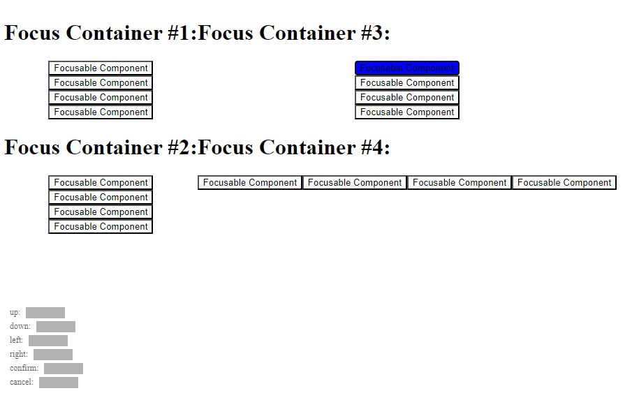

# React Unified Input

Unified focus navigation and input using keyboard, gamepad, and mouse for ReactJS.

## Getting Started

1. Clone this project: `git clone git@github.com:whoisryosuke/react-unified-input.git`
1. Install dependencies: `pnpm`
1. Start the dev server: `pnpm dev`

Open the app in your web browser, you should see the app.

## How to use

1. Install the library `npm i react-unified-input`
2. Add the `<InputManager />` to your app to enable focus navigation.
3. Create a focusable component by using the `useFocusable()` hook inside a React component and pass the ref the underlying DOM element (see [the ExampleFocusComponent](src\examples\HelloWorldExample\ExampleFocusComponent.tsx) for an example).
4. Spin up your app and try navigating using the keyboards arrow keys.

> Interested in learning more? [Check out my blog](https://whoisryosuke.com/blog), where I break down how this works.

### Focus containers

You can control focus navigation a bit using the concept of "focus containers".

When you navigate, the algorithm will look for items in the same container first -- then look outside of it. This helps you create controlled focus areas, like a navigation or list.

We provide a [FocusContainer](src\components\FocusContainer\FocusContainer.tsx) out of the box, but you can also make your own if you need more custom behavior.

### Set focus manually

You can use the `setFocusedItem()` function exposed through the focus store, with the `focusId` exposed by the `useFocusable()` hook.

```jsx
const ExampleFocusComponent = () => {
  const { ref, focusId } = useFocusable<HTMLButtonElement>();
  const { setFocusedItem } = useFocusStore();

    // Focus item when it first loads
    useEffect(() => {
        setFocusedItem(focusId);
    }, [])

    //...your component here
}
```

### Changing keymap

If you need to change the keymap for keyboard or gamepad, you can use the `setGamepadMap()` function exposed through the focus store.

1. Import the focus store: `import { useFocusStore } from "react-unified-input"`
1. Use the hook inside your component and : `const { setGamepadMap } = useFocusStore();`
1. Change the keymap to your liking. You can see an example [in the default keymaps for each device.](src\constants\input.ts)

### Key guides

Sometimes in UI you need to convey the meaning behind a certain input. This is incredibly common in video game where the user needs to be reminded what button on their gamepad does what. We see this in games like Assassin's Creed or Kingdom Hearts. If you're playing on PlayStation with a gamepad you'll see their trademark symbols - but if you play on PC using a keyboard, you might see keyboard buttons instead.

These are commonly referred to as "key guides" and they are text and/or iconography that informs the user how their device interfaces with the application or game. And as I described, they're often adaptive to the current conditions - so if the user swaps devices, the key guides need to update to match the correct device.

We expose a `currentDevice` from the `useFocusStore()` hook that lets you know what was the last device in use.

Using this variable combined with `keyboardMap` and `gamepadMap`, you can create a `<KeyGuide>` component that displays the input to the user as their current device. So you can have a `<KeyGuide input="confirm" />` that shows the user the "Enter" key on keyboard or the "X" key on gamepad.

### Animated components

What happens when a component is animated but has focus? Ideally the focus travels with the element. And with this library - it does! - kinda.

When the user presses any button to navigate, the position of all focus items are updated. But if for some reason the focus isn't updating it's position at the rate you need, you can manually update the focus element's position using the `updatePosition()` function provided through the `useFocusStore()` hook.

You can see an example of this in [ExampleAnimatedComponent](src/examples/HelloWorldExample/ExampleAnimatedComponent.tsx).

## Release

1. Bump version in `package.json`
1. `yarn build`
1. `npm publish`
